# METADATA_DB: Comprehensive Data Dictionary & Database Specification

---

## 1. Executive Summary & Architectural Overview

The **`METADATA_DB`** (formerly `nifi_control_db`) serves as the centralized metadata repository, execution tracking engine, and resilience coordinator for the **Enterprise Metadata-Driven Ingestion Engine**.

It decouples enterprise scheduling systems (such as Automic UC4) from data transformation and physical persistence layers (Apache NiFi and Parquet Bronze Storage). 

```
                                 +-------------------------+
                                 |  Enterprise Scheduler   |
                                 |       (Automic UC4)     |
                                 +------------+------------+
                                              | HTTP POST / GET
                                              v
+-----------------------+        +-------------------------+        +-----------------------+
|  Transactional Source |        |   Apache NiFi Cluster   |        | Bronze Storage Layer  |
|       Database        | <===== |   & Orchestrator Engine | =====> |  (Local / Parquet /   |
|     (mssql-source)    |        |  (ingestion_engine)     |        |       Iceberg)        |
+-----------------------+        +------------+------------+        +-----------------------+
                                              | 100% Stored Procedures
                                              v
                                 +-------------------------+
                                 |       METADATA_DB       |
                                 |     (mssql-metadata)    |
                                 +-------------------------+
```

### Core Architectural Principles
1. **100% Stored Procedure Encapsulation**: All reads, status evaluations, watermark advances, error logging, and execution starts are invoked exclusively via dedicated stored procedures (`USP_*`). No raw DML/DDL is executed by runtime pipelines.
2. **Standardized High-Precision Audit Timestamps**: In Microsoft SQL Server, `TIMESTAMP` is a legacy synonym for `ROWVERSION` (a binary counter without date/time values). To provide the true SQL/ANSI equivalent of a timestamp, all tables strictly implement:
   - `BI_CREATED_DATE DATETIME2 NOT NULL DEFAULT CURRENT_TIMESTAMP`
   - `BI_MODIFIED_DATE DATETIME2 NOT NULL DEFAULT CURRENT_TIMESTAMP`
3. **Predefined Transient Error Filtering**: In-flight retries are permitted **strictly** for errors present and active in the `TRANSIENT_ERRORS` table. Any error not classified as transient triggers an immediate, zero-retry **fail-fast** rollback.
4. **Two-Phase Watermark Commit**: High watermarks in `WATERMARKS` advance only upon 100% successful staging of all FlowFiles in an execution cycle.

---

## 2. Core Architectural Rationale & Design Decisions

### 2.1 Why Two Separate Tables (`SOURCES` & `DESTINATIONS`) Instead of a Single Mapping Table?

A frequent design question is whether a single flat table (e.g. `SOURCE_TO_DESTINATION_MAPPING`) could replace the two dedicated `SOURCES` and `DESTINATIONS` tables. The framework intentionally decouples them based on four foundational enterprise requirements:

1. **1:N Fan-Out Architecture (Single Extraction, Multiple Sinks)**:
   - In modern data platforms, data extracted once from an operational source table frequently needs to replicate to multiple heterogeneous destinations concurrently (e.g., ADLS Gen2 Bronze raw Parquet storage, an Apache Iceberg operational table, and a downstream relational audit table).
   - In a single combined table, adding a second destination forces complete duplication of source extraction configurations (source table names, custom select queries, watermark column names, chunk sizes, and source-side rate throttles).
   - Decoupling them allows a clean 1:N relationship where extraction logic is defined once per job, and multiple destinations can subscribe to the extracted FlowFiles without redundant extraction or repeated watermarking.

2. **Orthogonal Domain Concerns & Schema Normalization**:
   - **Source Parameters**: JDBC fetch size, read concurrency, query predicates, watermark tracking column, throttle rates, source key definitions.
   - **Destination Parameters**: Output directory templates, storage formats (Parquet, Iceberg, Delta), compression codecs (Snappy, Zstandard), backpressure thresholds, partition folder schemes (`year=.../month=...`), target upsert/merge keys.
   - Combining these distinct operational domains produces an excessively wide, sparse table with high nullability whenever a pipeline uses object stores instead of databases, or vice versa.

3. **Two-Phase Commit and Independent Rollback Semantics**:
   - Extraction (`SOURCES`) and Watermarking (`WATERMARKS`) are coupled to upstream source state.
   - Landing (`DESTINATIONS`) is coupled to downstream staging storage.
   - When a job fails, the atomic recovery process must clean up only the destination staging area (e.g., recursively deleting `/bronze/<table>/_tmp_<id>/` or truncating a target staging table) while freezing the source watermark at its pre-run state. Having separate entities cleanly aligns with this two-phase commit discipline.

4. **Polyglot Extensibility**:
   - As new sources (REST APIs, SFTP servers, Kafka topics) and new destinations (Snowflake, Databricks Unity, CosmosDB) are introduced, their specialized configuration schemas can evolve independently without cross-polluting one another.

---

### 2.2 Why a Dedicated `CONF_CONNECTIONS` Table?

Connection parameters are deliberately extracted into an isolated `INGFW.CONF_CONNECTIONS` catalog rather than inlined into sources and destinations:

1. **Elimination of Redundancy (DRY Principle)**:
   - An enterprise deployment typically extracts dozens or hundreds of tables from the same source database instance (e.g. ERP SQL Server) and writes them to the same ADLS Gen2 storage container.
   - Storing hostnames, port numbers, SSL configs, and protocols inside every source or destination row creates massive duplication and severe maintenance overhead.

2. **Single-Point Rotation & Endpoint Migration**:
   - When a database host migrates (e.g. moving from on-premises to an Azure SQL Managed Instance), fails over to a secondary disaster-recovery replica, or rotates passwords, only **one** record in `INGFW.CONF_CONNECTIONS` needs to be updated. All associated jobs immediately inherit the update with zero downtime and zero manual edits to table configurations.

3. **Zero Plain-Text Credentials & Key Vault Integration**:
   - The `CONF_CONNECTIONS` table stores `keyvault_secret_name` instead of raw passwords or connection strings. NiFi Parameter Context synchronization and deployment pipelines use `CONF_CONNECTIONS` as the authoritative source of truth to bind infrastructure secrets dynamically at runtime.

4. **Connection Pool & Resource Management**:
   - Apache NiFi manages connection pooling (e.g., `DBCPConnectionPool`) at the controller service level. The `CONF_CONNECTIONS` entity maps 1:1 to NiFi controller services, allowing database-level connection ceilings and validation queries to be throttled globally rather than per pipeline.

---

### 2.3 Architectural Analysis: Table Prefixing Strategy (`CONF_` vs. `LOG_`)

Prefixing tables according to functional roles (`CONF_` for configuration tables and `LOG_` for execution tracking tables) provides significant advantages in enterprise database management:

| Proposed Prefix | Target Tables | Functional Role | Lifecycle & Mutation Pattern |
| :--- | :--- | :--- | :--- |
| **`CONF_`** | `CONF_BATCHES`, `CONF_BATCH_JOBS`, `CONF_CONNECTIONS`, `CONF_SOURCES`, `CONF_DESTINATIONS`, `CONF_SOURCE_KEYS`, `CONF_WATERMARKS`, `CONF_TRANSIENT_ERRORS` | Pipeline topology, connection parameters, error classification rules, and watermark state. | Low-frequency mutation; edited via version-controlled Flyway DML or metadata UI. |
| **`LOG_`** | `LOG_BATCH_EXECUTIONS`, `LOG_JOB_EXECUTIONS`, `LOG_JOB_ERRORS` | Runtime audit trails, job metrics, row counts, and diagnostic exception stack traces. | High-frequency append-only streaming writes; requires partition sliding and retention purging. |

#### Benefits:
- **Instant Visual Distinction**: Engineers instantly know whether a query targets pipeline definition rules or append-only runtime telemetry.
- **Operational Maintenance & Archival**: Retention policies (e.g. archiving or truncating logs older than 90 days) can safely target `LOG_%` tables via wildcard scripts without risking configuration tables.
- **Least-Privilege Security (RBAC)**: Simplifies granting permissions: the NiFi runtime user requires `SELECT` on `CONF_%` tables, but `INSERT, UPDATE` on `LOG_%` tables.

---

## 3. Entity-Relationship (ER) Diagram

```mermaid
erDiagram
    CONF_BATCHES ||--o{ CONF_BATCH_JOBS : "contains (1:N)"
    CONF_BATCH_JOBS ||--o{ CONF_BATCH_JOBS : "parent_job_id (1:N self-ref)"
    CONF_BATCH_JOBS ||--o{ CONF_SOURCES : "configures extraction (1:N)"
    CONF_BATCH_JOBS ||--o{ CONF_DESTINATIONS : "configures landing (1:N)"
    CONF_CONNECTIONS ||--o{ CONF_SOURCES : "provides source conn (1:N)"
    CONF_CONNECTIONS ||--o{ CONF_DESTINATIONS : "provides dest conn (1:N)"
    CONF_SOURCES ||--o{ CONF_SOURCE_KEYS : "defines primary keys (1:N)"
    CONF_SOURCES ||--|| CONF_WATERMARKS : "tracks watermark (1:1)"
    CONF_BATCHES ||--o{ LOG_BATCH_EXECUTIONS : "invokes (1:N)"
    LOG_BATCH_EXECUTIONS ||--o{ LOG_JOB_EXECUTIONS : "tracks job run (1:N)"
    CONF_BATCH_JOBS ||--o{ LOG_JOB_EXECUTIONS : "executed as (1:N)"
    LOG_BATCH_EXECUTIONS ||--o{ LOG_JOB_ERRORS : "logs errors (1:N)"
    LOG_JOB_EXECUTIONS ||--o{ LOG_JOB_ERRORS : "logs errors (1:N)"
    CONF_TRANSIENT_ERRORS ||--o{ CONF_BATCH_JOBS : "evaluates in-flight retries"

    CONF_BATCHES {
        int ID PK "Identity(1,1)"
        varchar BATCH_NAME UK "Unique batch name"
        nvarchar DESCRIPTION "Business purpose"
        varchar RECOVERY_STRATEGY "IGNORE, FAIL, RESTART"
        int MAX_TRIES "Batch retry limit"
        bit IS_ACTIVE "Active flag"
        int JOB_STAGGER_DELAY "Delay in seconds"
        datetime2 BI_CREATED_DATE "Creation timestamp"
        datetime2 BI_MODIFIED_DATE "Update timestamp"
    }

    CONF_BATCH_JOBS {
        int ID PK "Identity(1,1)"
        int BATCH_ID FK "References CONF_BATCHES(ID)"
        varchar JOB_NAME UK "Unique job name"
        varchar JOB_TYPE "NO_RETRY or WITH_RETRY"
        int PARENT_JOB_ID FK "Self-referencing dependency"
        int TRANSIENT_ERROR_RETRY_COUNT "Max transient retries"
        tinyint CLEANUP_ON_ERROR "1 = purge staging dir"
        int MAX_RETRY_ATTEMPTS "Job attempt ceiling"
        bit IS_ACTIVE "Active flag"
        datetime2 BI_CREATED_DATE "Creation timestamp"
        datetime2 BI_MODIFIED_DATE "Update timestamp"
    }

    CONF_CONNECTIONS {
        int ID PK "Identity(1,1)"
        varchar CONNECTION_NAME UK "Unique connection identifier"
        varchar CONNECTION_TYPE "MSSQL, PARQUET_LANDING, etc."
        nvarchar CONNECTION_PROPERTIES "JSON connection attributes"
        datetime2 BI_CREATED_DATE "Creation timestamp"
        datetime2 BI_MODIFIED_DATE "Update timestamp"
    }

    CONF_SOURCES {
        int ID PK "Identity(1,1)"
        int JOB_ID FK "References CONF_BATCH_JOBS(ID)"
        int CONNECTION_ID FK "References CONF_CONNECTIONS(ID)"
        nvarchar SOURCE_PROPERTIES "JSON schema, table, custom SQL"
        varchar WATERMARK_FIELD "Column for incremental check"
        varchar WATERMARK_TYPE "BIGINT, TIMESTAMP, STRING"
        int CHUNK_SIZE "FlowFile batch size"
        int THROTTLE_RATE_TYPE "0=per sec, 1=absolute"
        int THROTTLE_RATE "Throttle cap"
        datetime2 BI_CREATED_DATE "Creation timestamp"
        datetime2 BI_MODIFIED_DATE "Update timestamp"
    }

    CONF_DESTINATIONS {
        int ID PK "Identity(1,1)"
        int JOB_ID FK "References CONF_BATCH_JOBS(ID)"
        int CONNECTION_ID FK "References CONF_CONNECTIONS(ID)"
        nvarchar DESTINATION_PROPERTIES "JSON path, format, compression"
        int CHUNK_SIZE "Target file chunk size"
        int BACK_PRESSURE_LIMIT "NiFi queue threshold"
        datetime2 BI_CREATED_DATE "Creation timestamp"
        datetime2 BI_MODIFIED_DATE "Update timestamp"
    }

    CONF_SOURCE_KEYS {
        int ID PK "Identity(1,1)"
        int SOURCE_ID FK "References CONF_SOURCES(ID)"
        varchar KEY_FIELD "Primary / clustering key column"
        datetime2 BI_CREATED_DATE "Creation timestamp"
        datetime2 BI_MODIFIED_DATE "Update timestamp"
    }

    CONF_WATERMARKS {
        int SOURCE_ID PK,FK "References CONF_SOURCES(ID)"
        bigint LAST_WATERMARK_VAL "Highest numerical watermark"
        datetime2 LAST_WATERMARK_TIMESTAMP "Highest temporal watermark"
        varchar LAST_WATERMARK_STR "String watermark value"
        nvarchar WATERMARK_STATE "JSON auxiliary state payload"
        datetime2 BI_CREATED_DATE "Creation timestamp"
        datetime2 BI_MODIFIED_DATE "Update timestamp"
    }

    LOG_BATCH_EXECUTIONS {
        int ID PK "Identity(1,1)"
        int BATCH_ID FK "References CONF_BATCHES(ID)"
        varchar INVOCATION_ID UK "Run token (e.g. b-exec-...)"
        varchar STATUS "RUNNING, SUCCESS, FAILED"
        datetime2 START_TIME "Batch start timestamp"
        datetime2 END_TIME "Batch finish timestamp"
        nvarchar ERROR_MESSAGE "Summary error text"
        datetime2 BI_CREATED_DATE "Creation timestamp"
        datetime2 BI_MODIFIED_DATE "Update timestamp"
    }

    LOG_JOB_EXECUTIONS {
        int ID PK "Identity(1,1)"
        int BATCH_EXECUTION_ID FK "References LOG_BATCH_EXECUTIONS(ID)"
        int JOB_ID FK "References CONF_BATCH_JOBS(ID)"
        varchar STATUS "PENDING, RUNNING, SUCCESS, FAILED"
        bigint RECORDS_PROCESSED "Total rows persisted"
        varchar WATERMARK_START "Pre-run watermark snapshot"
        varchar WATERMARK_END "Post-run watermark snapshot"
        datetime2 START_TIME "Job start timestamp"
        datetime2 END_TIME "Job finish timestamp"
        varchar RECOVERY_ACTION_TAKEN "e.g. DELETED_TMP_PARQUET"
        datetime2 BI_CREATED_DATE "Creation timestamp"
        datetime2 BI_MODIFIED_DATE "Update timestamp"
    }

    LOG_JOB_ERRORS {
        int ID PK "Identity(1,1)"
        int BATCH_INVOCATION_ID "Ref LOG_BATCH_EXECUTIONS(ID)"
        int JOB_INVOCATION_ID "Ref LOG_JOB_EXECUTIONS(ID)"
        varchar ERROR_CODE "Classified error identifier"
        nvarchar ERROR_MESSAGE "Raw or sanitized error text"
        nvarchar STACK_TRACE "Full diagnostic exception stack"
        datetime2 BI_CREATED_DATE "Creation timestamp"
        datetime2 BI_MODIFIED_DATE "Update timestamp"
    }

    CONF_TRANSIENT_ERRORS {
        int ID PK "Identity(1,1)"
        varchar ERROR_CODE UK "e.g. SOCKET_TIMEOUT, DEADLOCK"
        varchar ERROR_CATEGORY "NETWORK, CONCURRENCY, RATE_LIMIT"
        varchar EXCEPTION_CLASS "e.g. SocketTimeoutException"
        varchar ERROR_PATTERN "Substring/wildcard pattern (%...%)"
        nvarchar DESCRIPTION "Operational explanation"
        bit IS_ACTIVE "Enables/disables retry eligibility"
        datetime2 BI_CREATED_DATE "Creation timestamp"
        datetime2 BI_MODIFIED_DATE "Update timestamp"
    }
```



---

## 4. Database Table Specifications

### 4.1 Pipeline Configuration Layer

---

#### 4.1.1 Table: `INGFW.CONF_BATCHES`
* **Description**: Represents a top-level ingestion batch, encompassing one or more jobs executed sequentially or with staggered delays under a unified recovery strategy.
* **Primary Key**: `ID`

| Column Name | Data Type | Nullable | Default | Description |
| :--- | :--- | :---: | :---: | :--- |
| `ID` | `INT IDENTITY(1,1)` | No | Auto | Primary key surrogate identifier. |
| `BATCH_NAME` | `VARCHAR(255)` | No | - | Unique enterprise batch identifier (e.g., `BAT_POST_STAGING_001`). |
| `DESCRIPTION` | `NVARCHAR(MAX)` | Yes | NULL | Human-readable explanation of the batch domain and workloads. |
| `RECOVERY_STRATEGY` | `VARCHAR(50)` | No | `'IGNORE'` | Policy when jobs fail: `IGNORE` (partial success), `FAIL`, `BATCH_RESTART`, `JOB_RESTART`. |
| `MAX_TRIES` | `INT` | No | `0` | Upper limit for full batch-level restarts. |
| `IS_ACTIVE` | `BIT` | No | `1` | `1` = Eligible for execution; `0` = Disabled. |
| `JOB_STAGGER_DELAY` | `INT` | No | `5` | Delay in seconds between successive job dispatches. |
| `BI_CREATED_DATE` | `DATETIME2` | No | `CURRENT_TIMESTAMP` | Record creation timestamp. |
| `BI_MODIFIED_DATE` | `DATETIME2` | No | `CURRENT_TIMESTAMP` | Record last modification timestamp. |

---

#### 4.1.2 Table: `INGFW.CONF_BATCH_JOBS`
* **Description**: Defines individual table extraction pipelines belonging to a batch, including dependency relationships, pipeline types, and retry parameters.
* **Primary Key**: `ID`
* **Foreign Keys**:
  * `BATCH_ID` $\rightarrow$ `INGFW.CONF_BATCHES(ID)` (ON DELETE CASCADE)
  * `PARENT_JOB_ID` $\rightarrow$ `INGFW.CONF_BATCH_JOBS(ID)` (Nullable, DAG dependency)

| Column Name | Data Type | Nullable | Default | Description |
| :--- | :--- | :---: | :---: | :--- |
| `ID` | `INT IDENTITY(1,1)` | No | Auto | Primary key surrogate identifier. |
| `BATCH_ID` | `INT` | No | - | Foreign key to parent batch. |
| `JOB_NAME` | `VARCHAR(255)` | No | - | Unique job identifier (e.g., `J_POST_STAGING_001`). |
| `JOB_TYPE` | `VARCHAR(50)` | No | - | Ingestion pipeline variant: `RDBMS_TO_PARQUET_NO_RETRY` or `RDBMS_TO_PARQUET_WITH_RETRY`. |
| `PARENT_JOB_ID` | `INT` | Yes | NULL | Self-referencing FK specifying prerequisite job before dispatch. |
| `TRANSIENT_ERROR_RETRY_COUNT` | `INT` | No | `0` | Maximum allowable in-flight retries for transient errors. |
| `CLEANUP_ON_ERROR` | `TINYINT` | No | `1` | `1` = Purge temporary staging folder `_tmp_<id>` on job failure. |
| `MAX_RETRY_ATTEMPTS` | `INT` | No | `0` | Outer scheduler recovery attempt limit. |
| `IS_ACTIVE` | `BIT` | No | `1` | `1` = Active; `0` = Inactive. |
| `BI_CREATED_DATE` | `DATETIME2` | No | `CURRENT_TIMESTAMP` | Record creation timestamp. |
| `BI_MODIFIED_DATE` | `DATETIME2` | No | `CURRENT_TIMESTAMP` | Record last modification timestamp. |

---

#### 4.1.3 Table: `INGFW.CONF_CONNECTIONS`
* **Description**: Catalog of source and destination storage connection profiles, endpoints, and credentials.
* **Primary Key**: `ID`

| Column Name | Data Type | Nullable | Default | Description |
| :--- | :--- | :---: | :---: | :--- |
| `ID` | `INT IDENTITY(1,1)` | No | Auto | Primary key surrogate identifier. |
| `CONNECTION_NAME` | `VARCHAR(255)` | No | - | Unique profile name (e.g., `CONN_MSSQL_SOURCE`, `CONN_PARQUET_DEST`). |
| `CONNECTION_TYPE` | `VARCHAR(50)` | No | - | Connection protocol: `MSSQL`, `PARQUET_LANDING`, `ORACLE`, `POSTGRESQL`. |
| `CONNECTION_PROPERTIES` | `NVARCHAR(MAX)` | No | - | JSON configuration containing host, port, database, base path, compression, etc. |
| `BI_CREATED_DATE` | `DATETIME2` | No | `CURRENT_TIMESTAMP` | Record creation timestamp. |
| `BI_MODIFIED_DATE` | `DATETIME2` | No | `CURRENT_TIMESTAMP` | Record last modification timestamp. |

---

#### 4.1.4 Table: `INGFW.CONF_SOURCES`
* **Description**: Source extraction metadata describing table schemas, custom SQL queries, watermark columns, chunking sizes, and throttle rates.
* **Primary Key**: `ID`
* **Foreign Keys**:
  * `JOB_ID` $\rightarrow$ `INGFW.CONF_BATCH_JOBS(ID)` (ON DELETE CASCADE)
  * `CONNECTION_ID` $\rightarrow$ `INGFW.CONF_CONNECTIONS(ID)`

| Column Name | Data Type | Nullable | Default | Description |
| :--- | :--- | :---: | :---: | :--- |
| `ID` | `INT IDENTITY(1,1)` | No | Auto | Primary key surrogate identifier. |
| `JOB_ID` | `INT` | No | - | Foreign key to associated batch job. |
| `CONNECTION_ID` | `INT` | No | - | Foreign key to source connection profile. |
| `SOURCE_PROPERTIES` | `NVARCHAR(MAX)` | Yes | NULL | JSON configuration containing `schema`, `table_name`, `custom_query`. |
| `WATERMARK_FIELD` | `VARCHAR(255)` | Yes | NULL | Source column used for incremental tracking (e.g., `id`, `modified_date`). |
| `WATERMARK_TYPE` | `VARCHAR(50)` | Yes | NULL | Data type of watermark column: `BIGINT`, `TIMESTAMP`, `STRING`. |
| `CHUNK_SIZE` | `INT` | Yes | `1000` | Micro-batch row size extracted per query. |
| `THROTTLE_RATE_TYPE` | `INT` | Yes | `0` | `0` = Rate per second; `1` = Absolute transaction count. |
| `THROTTLE_RATE` | `INT` | Yes | `5` | Maximum requests permitted per unit interval. |
| `BI_CREATED_DATE` | `DATETIME2` | No | `CURRENT_TIMESTAMP` | Record creation timestamp. |
| `BI_MODIFIED_DATE` | `DATETIME2` | No | `CURRENT_TIMESTAMP` | Record last modification timestamp. |

---

#### 4.1.5 Table: `INGFW.CONF_DESTINATIONS`
* **Description**: Target landing configurations for jobs, specifying output directory paths, file formats, and back-pressure limits.
* **Primary Key**: `ID`
* **Foreign Keys**:
  * `JOB_ID` $\rightarrow$ `INGFW.CONF_BATCH_JOBS(ID)` (ON DELETE CASCADE)
  * `CONNECTION_ID` $\rightarrow$ `INGFW.CONF_CONNECTIONS(ID)`

| Column Name | Data Type | Nullable | Default | Description |
| :--- | :--- | :---: | :---: | :--- |
| `ID` | `INT IDENTITY(1,1)` | No | Auto | Primary key surrogate identifier. |
| `JOB_ID` | `INT` | No | - | Foreign key to associated batch job. |
| `CONNECTION_ID` | `INT` | No | - | Foreign key to destination connection profile. |
| `DESTINATION_PROPERTIES`| `NVARCHAR(MAX)` | Yes | NULL | JSON configuration containing `target_dir`, `format`, `compression`. |
| `CHUNK_SIZE` | `INT` | Yes | `1000` | Target Parquet chunk row count. |
| `BACK_PRESSURE_LIMIT` | `INT` | Yes | `10000`| NiFi connection queue threshold before pausing upstream fetch. |
| `BI_CREATED_DATE` | `DATETIME2` | No | `CURRENT_TIMESTAMP` | Record creation timestamp. |
| `BI_MODIFIED_DATE` | `DATETIME2` | No | `CURRENT_TIMESTAMP` | Record last modification timestamp. |

---

#### 4.1.6 Table: `INGFW.CONF_SOURCE_KEYS`
* **Description**: Maps one or more primary or clustering key fields for a given source table to guarantee idempotent ingestion and deduplication.
* **Primary Key**: `ID`
* **Foreign Key**: `SOURCE_ID` $\rightarrow$ `INGFW.CONF_SOURCES(ID)` (ON DELETE CASCADE)

| Column Name | Data Type | Nullable | Default | Description |
| :--- | :--- | :---: | :---: | :--- |
| `ID` | `INT IDENTITY(1,1)` | No | Auto | Primary key surrogate identifier. |
| `SOURCE_ID` | `INT` | No | - | Foreign key to source definition. |
| `KEY_FIELD` | `VARCHAR(255)` | No | - | Column name participating in table key. |
| `BI_CREATED_DATE` | `DATETIME2` | No | `CURRENT_TIMESTAMP` | Record creation timestamp. |
| `BI_MODIFIED_DATE` | `DATETIME2` | No | `CURRENT_TIMESTAMP` | Record last modification timestamp. |

---

#### 4.1.7 Table: `INGFW.CONF_WATERMARKS`
* **Description**: Maintains the two-phase commit high watermarks per source table, ensuring exactly-once / incremental extraction.
* **Primary Key**: `SOURCE_ID`
* **Foreign Key**: `SOURCE_ID` $\rightarrow$ `INGFW.CONF_SOURCES(ID)` (ON DELETE CASCADE)

| Column Name | Data Type | Nullable | Default | Description |
| :--- | :--- | :---: | :---: | :--- |
| `SOURCE_ID` | `INT` | No | - | Primary key and foreign key referencing `CONF_SOURCES(ID)`. |
| `LAST_WATERMARK_VAL` | `BIGINT` | Yes | NULL | Highest integer/identity value extracted and committed. |
| `LAST_WATERMARK_TIMESTAMP` | `DATETIME2` | Yes | NULL | Highest temporal watermark extracted and committed. |
| `LAST_WATERMARK_STR` | `VARCHAR(255)` | Yes | NULL | Highest alphanumeric watermark value extracted. |
| `WATERMARK_STATE` | `NVARCHAR(MAX)` | Yes | NULL | Auxiliary JSON state data for multi-column watermark models. |
| `BI_CREATED_DATE` | `DATETIME2` | No | `CURRENT_TIMESTAMP` | Record creation timestamp. |
| `BI_MODIFIED_DATE` | `DATETIME2` | No | `CURRENT_TIMESTAMP` | Record last update timestamp (updated via `USP_ADVANCE_WATERMARK`). |

---

### 4.2 Observability & Execution Tracking Layer

---

#### 4.2.1 Table: `INGFW.LOG_BATCH_EXECUTIONS`
* **Description**: Records batch-level lifecycle invocations, status transitions, timestamps, and overall completion metrics.
* **Primary Key**: `ID`
* **Foreign Key**: `BATCH_ID` $\rightarrow$ `INGFW.CONF_BATCHES(ID)`

| Column Name | Data Type | Nullable | Default | Description |
| :--- | :--- | :---: | :---: | :--- |
| `ID` | `INT IDENTITY(1,1)` | No | Auto | Primary key surrogate identifier. |
| `BATCH_ID` | `INT` | No | - | Foreign key to batch definition. |
| `INVOCATION_ID` | `VARCHAR(255)` | No | - | Unique invocation token (e.g., `b-exec-20260904-120000-abcd12`). |
| `STATUS` | `VARCHAR(50)` | No | - | Execution status: `RUNNING`, `SUCCESS`, `PARTIAL_SUCCESS`, `FAILED`. |
| `START_TIME` | `DATETIME2` | No | `CURRENT_TIMESTAMP` | Timestamp when batch processing began. |
| `END_TIME` | `DATETIME2` | Yes | NULL | Timestamp when batch processing concluded. |
| `ERROR_MESSAGE` | `NVARCHAR(MAX)` | Yes | NULL | Summary error message on failure. |
| `BI_CREATED_DATE` | `DATETIME2` | No | `CURRENT_TIMESTAMP` | Record creation timestamp. |
| `BI_MODIFIED_DATE` | `DATETIME2` | No | `CURRENT_TIMESTAMP` | Record last modification timestamp. |

---

#### 4.2.2 Table: `INGFW.LOG_JOB_EXECUTIONS`
* **Description**: Detailed per-job tracking within a batch execution, storing starting/ending watermarks, row counts, and atomic rollback actions.
* **Primary Key**: `ID`
* **Foreign Keys**:
  * `BATCH_EXECUTION_ID` $\rightarrow$ `INGFW.LOG_BATCH_EXECUTIONS(ID)` (ON DELETE CASCADE)
  * `JOB_ID` $\rightarrow$ `INGFW.CONF_BATCH_JOBS(ID)`

| Column Name | Data Type | Nullable | Default | Description |
| :--- | :--- | :---: | :---: | :--- |
| `ID` | `INT IDENTITY(1,1)` | No | Auto | Primary key surrogate identifier. |
| `BATCH_EXECUTION_ID` | `INT` | No | - | Foreign key to parent batch execution instance. |
| `JOB_ID` | `INT` | No | - | Foreign key to batch job definition. |
| `STATUS` | `VARCHAR(50)` | No | - | Job status: `PENDING`, `RUNNING`, `SUCCESS`, `FAILED`, `SKIPPED`. |
| `RECORDS_PROCESSED` | `BIGINT` | No | `0` | Number of rows extracted and successfully persisted to Parquet. |
| `WATERMARK_START` | `VARCHAR(255)` | Yes | NULL | Starting watermark snapshot before extraction. |
| `WATERMARK_END` | `VARCHAR(255)` | Yes | NULL | Ending watermark value upon completion. |
| `START_TIME` | `DATETIME2` | No | `CURRENT_TIMESTAMP` | Timestamp when job execution started. |
| `END_TIME` | `DATETIME2` | Yes | NULL | Timestamp when job finished or failed. |
| `RECOVERY_ACTION_TAKEN`| `VARCHAR(255)`| Yes | NULL | Description of cleanup (e.g., `DELETED_TMP_PARQUET_DIRECTORY`). |
| `BI_CREATED_DATE` | `DATETIME2` | No | `CURRENT_TIMESTAMP` | Record creation timestamp. |
| `BI_MODIFIED_DATE` | `DATETIME2` | No | `CURRENT_TIMESTAMP` | Record last modification timestamp. |

---

#### 4.2.3 Table: `INGFW.LOG_JOB_ERRORS`
* **Description**: Centralized execution failure repository recording structured error codes, messages, and stack traces.
* **Primary Key**: `ID`

| Column Name | Data Type | Nullable | Default | Description |
| :--- | :--- | :---: | :---: | :--- |
| `ID` | `INT IDENTITY(1,1)` | No | Auto | Primary key surrogate identifier. |
| `BATCH_INVOCATION_ID` | `INT` | No | - | Refers to `LOG_BATCH_EXECUTIONS(ID)`. |
| `JOB_INVOCATION_ID` | `INT` | Yes | NULL | Refers to `LOG_JOB_EXECUTIONS(ID)`. |
| `ERROR_CODE` | `VARCHAR(50)` | No | - | Classified error code (e.g., `PERMANENT_ERROR`, `SOCKET_TIMEOUT`). |
| `ERROR_MESSAGE` | `NVARCHAR(MAX)` | No | - | Error message or sanitized root cause. |
| `STACK_TRACE` | `NVARCHAR(MAX)` | Yes | NULL | Full diagnostic trace or context text. |
| `BI_CREATED_DATE` | `DATETIME2` | No | `CURRENT_TIMESTAMP` | Record creation timestamp. |
| `BI_MODIFIED_DATE` | `DATETIME2` | No | `CURRENT_TIMESTAMP` | Record last modification timestamp. |

---

### 4.3 Resilience & Error Policy Layer

---

#### 4.3.1 Table: `INGFW.CONF_TRANSIENT_ERRORS`
* **Description**: Authoritative catalog of approved transient errors. NiFi FlowFiles and the orchestration engine query this table before retrying; any error not matched here causes an immediate, zero-retry failure.
* **Primary Key**: `ID`

| Column Name | Data Type | Nullable | Default | Description |
| :--- | :--- | :---: | :---: | :--- |
| `ID` | `INT IDENTITY(1,1)` | No | Auto | Primary key surrogate identifier. |
| `ERROR_CODE` | `VARCHAR(100)` | No | - | Unique error identifier (e.g., `SOCKET_TIMEOUT`, `DEADLOCK`). |
| `ERROR_CATEGORY` | `VARCHAR(100)` | No | - | Category: `NETWORK_TIMEOUT`, `DATABASE_CONCURRENCY`, `RATE_LIMIT_THROTTLING`. |
| `EXCEPTION_CLASS` | `VARCHAR(255)` | No | - | Target Java/Python exception class name (e.g., `SocketTimeoutException`). |
| `ERROR_PATTERN` | `VARCHAR(255)` | No | - | SQL wildcard pattern matched against raw error message (e.g., `%Deadlock%`). |
| `DESCRIPTION` | `NVARCHAR(MAX)` | Yes | NULL | Contextual explanation of the transient fault and mitigation. |
| `IS_ACTIVE` | `BIT` | No | `1` | `1` = Retry permitted; `0` = Disabled (treat as permanent). |
| `BI_CREATED_DATE` | `DATETIME2` | No | `CURRENT_TIMESTAMP` | Record creation timestamp. |
| `BI_MODIFIED_DATE` | `DATETIME2` | No | `CURRENT_TIMESTAMP` | Record last modification timestamp. |

---

## 5. Stored Procedures Interface Reference

All interaction with `METADATA_DB` is mediated exclusively through these 14 stored procedures:

| Stored Procedure Name | Input Parameters | Output / Results | Purpose |
| :--- | :--- | :--- | :--- |
| `INGFW.USP_RESOLVE_BATCH_OR_JOB` | `@BatchName VARCHAR(255)`, `@JobName VARCHAR(255)` | Batch configs and active child job rows. | Resolves DAG execution plans, recovery strategy, and retry limits. |
| `INGFW.USP_GET_JOB_SOURCE_CONFIG` | `@JobId INT` | Source table, connection config, watermark column, current watermark. | Prepares NiFi extraction processors with database source metadata. |
| `INGFW.USP_CREATE_BATCH_EXECUTION` | `@BatchId INT`, `@InvocationId VARCHAR(255)`, `@Status VARCHAR(50)` | `BATCH_EXECUTION_ID INT` | Inserts a new run into `LOG_BATCH_EXECUTIONS` (`RUNNING`). |
| `INGFW.USP_UPDATE_BATCH_EXECUTION_STATUS` | `@BatchExecutionId INT`, `@Status VARCHAR(50)`, `@ErrorMessage NVARCHAR(MAX)` | None | Finalizes batch outcome (`SUCCESS`, `PARTIAL_SUCCESS`, `FAILED`). |
| `INGFW.USP_CREATE_JOB_EXECUTION` | `@BatchExecutionId INT`, `@JobId INT`, `@WatermarkStart VARCHAR(255)` | `JOB_EXECUTION_ID INT` | Inserts job run into `LOG_JOB_EXECUTIONS` with pre-run watermark snapshot. |
| `INGFW.USP_UPDATE_JOB_EXECUTION_SUCCESS` | `@JobExecutionId INT`, `@RecordsProcessed BIGINT`, `@WatermarkEnd VARCHAR(255)` | None | Records successful job run, row count, and closing watermark. |
| `INGFW.USP_UPDATE_JOB_EXECUTION_FAILURE` | `@JobExecutionId INT`, `@WatermarkEnd VARCHAR(255)` | None | Records job failure and retains pre-run watermark value. |
| `INGFW.USP_ADVANCE_WATERMARK` | `@SourceId INT`, `@NewWatermarkVal BIGINT` | None | Two-phase commit: updates `CONF_WATERMARKS` table. |
| `INGFW.USP_LOG_JOB_ERROR` | `@BatchExecutionId INT`, `@JobExecutionId INT`, `@ErrorCode VARCHAR(50)`, `@ErrorMessage NVARCHAR(MAX)`, `@StackTrace NVARCHAR(MAX)` | None | Centralized logging of errors with structured classification in `LOG_JOB_ERRORS`. |
| `INGFW.USP_GET_BATCH_EXECUTION_STATUS` | `@InvocationId VARCHAR(255)` | 3 Result Sets: (1) Batch Summary, (2) Job Details, (3) Error Logs | Generates the official UC4 contract JSON status payload. |
| `INGFW.USP_GET_WATERMARK_FOR_JOB` | `@JobName VARCHAR(255)` | `JOB_NAME`, `SOURCE_ID`, `LAST_WATERMARK_VAL`, `BI_MODIFIED_DATE` | Inspects current watermark position for monitoring or verification. |
| `INGFW.USP_GET_EXECUTION_LOGGING_SUMMARY`| None | `TOTAL_BATCH_EXECUTIONS`, `TOTAL_JOB_EXECUTIONS`, `TOTAL_JOB_ERRORS` | Audit helper verifying total executions and error frequency. |
| `INGFW.USP_CHECK_TRANSIENT_ERROR` | `@ErrorMessage NVARCHAR(MAX)` | `IS_TRANSIENT BIT`, `ERROR_CODE`, `ERROR_CATEGORY`, `EXCEPTION_CLASS` | **Evaluates errors against `CONF_TRANSIENT_ERRORS` to determine retry eligibility.** |
| `INGFW.USP_GET_TRANSIENT_ERRORS` | None | All active rows from `CONF_TRANSIENT_ERRORS` | Preloads transient error classification lists into NiFi cache. |

---

## 6. Transient vs. Permanent Error Evaluation Matrix

The orchestration engine and NiFi pipeline enforce the following evaluation matrix against `CONF_TRANSIENT_ERRORS`:

```
               [ Incoming Exception / Error ]
                             |
                             v
             [ Call USP_CHECK_TRANSIENT_ERROR ]
                             |
              +--------------+--------------+
              |                             |
       [ Match Found? ]              [ Match Found? ]
              | YES                         | NO
              v                             v
   [ TRANSIENT ERROR ]             [ PERMANENT ERROR ]
   - Category in table             - Not in CONF_TRANSIENT_ERRORS
   - Check Retry Count             - Immediate Fail-Fast (0 retries)
   - Apply Backoff Delay           - Purge Staging Directory (_tmp_<id>)
   - Re-execute FlowFile           - Log Error: PERMANENT_ERROR
   - If Max Exceeded: Clean & Fail - Mark Job FAILED
```

### Predefined Error Definitions Seeded in `CONF_TRANSIENT_ERRORS`

| ERROR_CODE | ERROR_CATEGORY | Target EXCEPTION_CLASS / Pattern | Retry Action |
| :--- | :--- | :--- | :--- |
| `SOCKET_TIMEOUT` | `NETWORK_TIMEOUT` | `SocketTimeoutException` (`%SocketTimeoutException%`) | Retry with backoff up to limit. |
| `CONNECT_TIMEOUT` | `NETWORK_TIMEOUT` | `ConnectTimeoutException` (`%ConnectTimeoutException%`) | Retry with backoff up to limit. |
| `CONNECTION_RESET` | `NETWORK_TIMEOUT` | `ConnectionResetException` (`%Connection reset%`) | Retry with backoff up to limit. |
| `CONNECTION_REFUSED` | `NETWORK_TIMEOUT` | `ConnectionRefusedException` (`%Connection refused%`) | Retry with backoff up to limit. |
| `DB_TIMEOUT` | `NETWORK_TIMEOUT` | `TimeoutError` (`%timeout%`) | Retry with backoff up to limit. |
| `DEADLOCK` | `DATABASE_CONCURRENCY` | `DeadlockVictimException` (`%Deadlock%`) | Retry with backoff up to limit. |
| `LOCK_WAIT_TIMEOUT`| `DATABASE_CONCURRENCY` | `LockWaitTimeoutException` (`%lock wait timeout%`) | Retry with backoff up to limit. |
| `POOL_STARVATION` | `DATABASE_CONCURRENCY` | `SQLTransientConnectionException` (`%connection pool starvation%`) | Retry with backoff up to limit. |
| `SQL_TRANSIENT` | `DATABASE_CONCURRENCY` | `SQLTransientException` (`%SQLTransient%`) | Retry with backoff up to limit. |
| `HTTP_429` | `RATE_LIMIT_THROTTLING` | `TooManyRequestsException` (`%429%`) | Honor backoff, retry up to limit. |
| `HTTP_503` | `RATE_LIMIT_THROTTLING` | `ServiceUnavailableException` (`%503%`) | Retry with backoff up to limit. |
| `HTTP_504` | `RATE_LIMIT_THROTTLING` | `GatewayTimeoutException` (`%504%`) | Retry with backoff up to limit. |
| *(Permanent)* | `AUTHENTICATION / SCHEMA` | E.g. `Invalid object name`, `Login failed`, `Syntax error`, `HTTP 401`, `HTTP 403` | **Fail-Fast (0 retries). Immediate cleanup.** |
